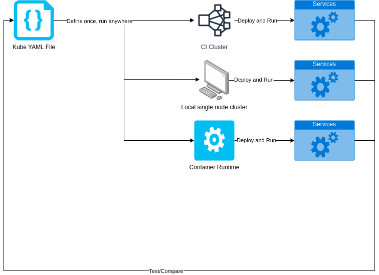

# Kubernetes Workloads Blueprint

## Overview

Use Kubernetes YAML files as deployment specification to define native workloads for automotive orchestrators.

This is a proposal to use Kubernetes YAML files to define both application and services workloads
in a [edge] vehicle device.

Kubernetes resource definitions are well stablished within the cloud industry and not only provide an API
to define containerized workloads but also allow applications to mount configuration files and so on.

    

## Capabilities

### Deployability

Using a single and well defined format to declare workloads allows several orchestrators, runtimes and platform to use
the same YAML source to deploy the same application or service:

* Use it in CI systems to test code changes in a Kubernetes cluster;
* Deploy using orchestrators and runtimes that support Kubernetes YAML APIs, including cloud digital twins;
* Easily test it locally using a local kubenetes "cluster" such as Minikube or container managers.

### Testeability

Using a static and declarative format allows tools to both assert and verify if a workload was properly deployed
by reading the YAML file and comparing it against any runtime that supports sourcing workload defintions from
such YAML files (assuming it knows how to use the runtime API to do so).

### Predictiability

Kubenetes YAML files allows one to defined the amount of resources (CPU, Memory and Storage) that will be used by the
service it is meant to represent, making its resource allocation predictable for orchestrators.

### Extendability

It's still possible to add runtime specific data in a Kubernetes YAML file while leaving the original/upstream defintion untouched
by adding extra [metadata](./https://kubernetes.io/docs/concepts/overview/working-with-objects/annotations/) targeting specific implementations, making it an "extendable" specification.

## Contributing

If you want to contribute bug reports or feature requests, please use *GitHub Issues*.

## Versions

| Release Date | Release              |
| ------------ | -------------------- |
| 2023 July    | [V1](releases/v1.md) |

## Maintainers

* Leonardo Rossetti (Red Hat)

## License

[Apache-2.0](./LICENSE)
